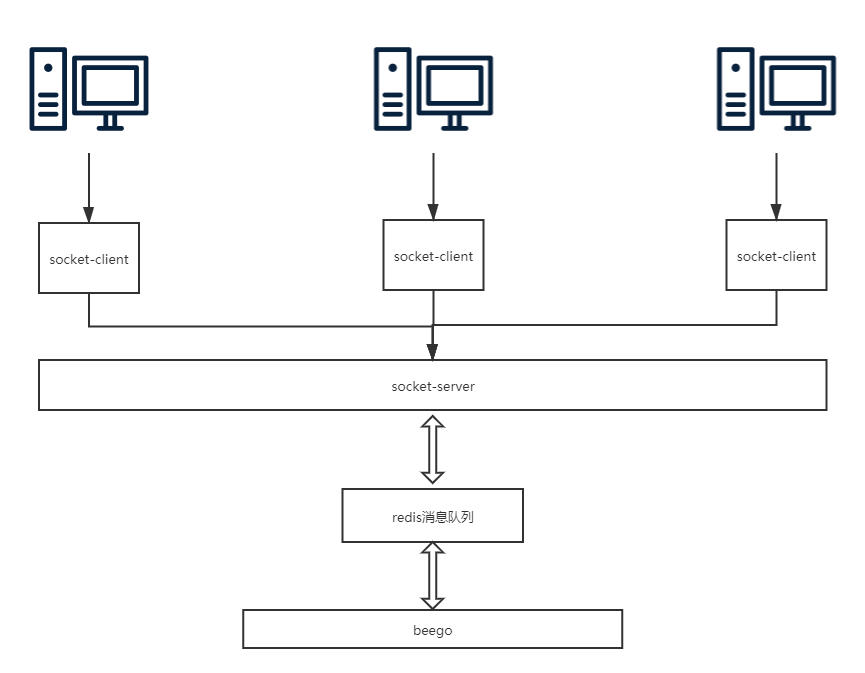

版本：
- [x] Go 1.10.3
- [x] mysql 5.7
- [x] beego v1.10.0

`RemoteCon`项目是通过beego远程控制windows的程控工具

#### 运行
1、启动redis消息队列，[代码在这里](https://github.com/legolas-zeng/GOPATH/tree/master/src/code/socket-code)

`
redis-server
`

2、启动socket服务

`
go run server.go
`

`
go run client.go
`

3、启动beego服务

`
bee run
`
